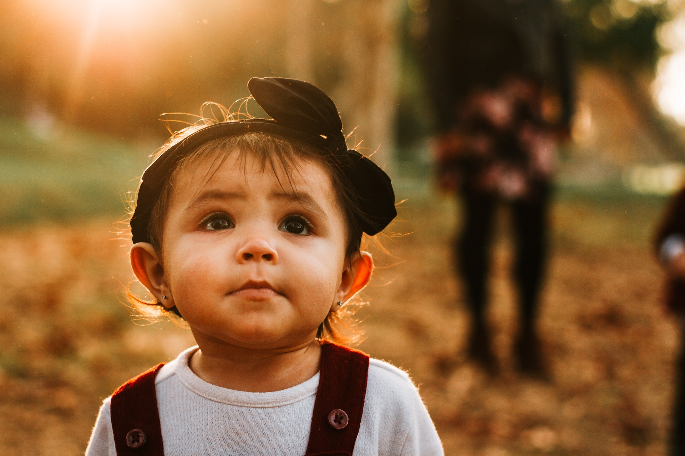

**EARLY EDUCATION**, *Learning Techniques* – As parents, early childhood education courses are necessary, but unrealistic. My blog is an informal backup tutorial teaching parents the ropes. 

I realize most parents don’t have the free time, extra finances, or academic interest. 
As a result, my blog is about teaching techniques that will equip parents to train their children – a true head start begins at home.

While earning my bachelor’s degree, college courses taught me skills that every parent needs to know and I’m sharing these secrets at no cost to readers.

It is important to recognize the value of home-based learning before preschool.   
Here’s how a child’s brain works. The human brain starts to develop 4 weeks after a woman is pregnant.

Neurons and synapses form the wiring of the brain. Neurons are like messengers within the brain. A synapse is the brain structure that allows the neurons to communicate. 

Upon birth, the brain nearly has all the neurons it will acquire. By age 3, the brain reaches 80% of its adult volume or structure. This is why early learning is critical and effective. As the brain develops, so does the child.  

At a rapid pace, neurons and synapses start working together, creating countless brain cells that allow your child to learn quickly. 

Toddlers have double the brain capacity than others. From birth to age 3, we experience the fastest rate of brain development in our entire human life span.

How well our children develop depends on us. Imagine teaching your child to read before age 3 – it’s possible – and it happens frequently for parents who put in the effort. Providing nurturing meals, proper rest, and lots of love are attributes of a good parent, but we have the ability to do so much more. Childhood potential is unlimited.  

As parents, we are the first teacher of our children.

Even when we are not purposely teaching them, they are continuously learning. Be ever so careful – watch what you do and say in their presence – children mimic good and bad behavior.
  
Children develop habits and routines by simple observation. 

Most parents seem to know this, but fail to focus on it throughout daily life. During my educational journey, my strategies as a mom changed.

I make a conscious daily decision to be a better person and parent. The first step toward training talented toddlers is putting forward a conscious effort to become a better you. 

Establish routines, embrace every second, and make every moment a teachable experience, knowing that our children are learning from our actions.  

Our children have a lot to learn. This blog will help challenge, push and celebrate them. 

Together, let’s use “**EARLY EDUCATION**, *Learning Techniques*” to give our kids the proper tools to become better versions of ourselves. 
