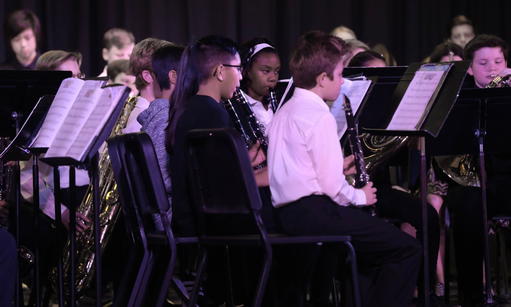

**THE THINK TANK**, *Elevating Consciousness* – Going back to school, if only for 30-minutes, resonated 
as music to my ears.

During a recent band concert, flutes, clarinets, saxophones, trumpets, trombones, baritones and 
percussions tickled ears and opened proverbial eyes.

As my 12-year-daughter, Amber, played the clarinet during the Fall concert, it suddenly struck 
me to do my homework about the importance of incorporating music into academics.

The sound of music suddenly embodied new meaning.

Band director Tracy Werner and Northern Arizona University student teacher Robert Hatley, 
showcased the talent of about 70 middle school students stage front.

The full production featured lights, cameras and action.

They performed 4 songs, *Rocky Mountain Romp* by Brian Balmages, *Harbinger* by Robert Sheldon, 
*Leader of the Class* by Ed Huckeby, and *March Onward* by John O’Reilly and Mark Williams.

Practice paid off – the advanced band members blended a cross between melody and harmony that 
prompted repeated applause from proud parents.

Music makes something magical happen that benefits learning even beyond reading the notes on the pages.

Many short-sited schools across the nation are eliminating music programs, blaming it on budget 
cuts. This is a mistake.

Music is universal – everybody likes it – whether listening, singing, or playing an instrument.

According to the National Association of Music Education, research proves that music benefits 
learners in 20 different ways.

Musical training helps develop language and reasoning. It helps with memorization. It improves 
student work by promoting craftsmanship.

Music improves hand-eye coordination and motor skills. It gives students a sense of achievement. 
It keeps kids interested in school.

Music is the fabric of our society strengthening opportunities of success and character.

It causes students to develop more empathy toward others cultures. Students learn pattern 
recognition.

It’s proven that music students score higher on the SAT. It fine-tunes auditory skills. 
Music builds imagination and intellectual curiosity.

It’s relaxing.

It teaches discipline. Investing in creative education prepare students for the 21st century 
workforce.

Music helps students think creatively which aids in problem solving. It has the ability to develop 
spatial intelligence which is helpful in advanced mathematics.

Music promotes teamwork.

The anxiety of performances teaches kids how to take healthy and responsible risks.

Lastly, music builds better self-confidence.

The Kyrene Middle School band inspired me to push parents to fight to get music back in all schools.

With no doubt, after doing the research, parents are sure to like the sound of it.
