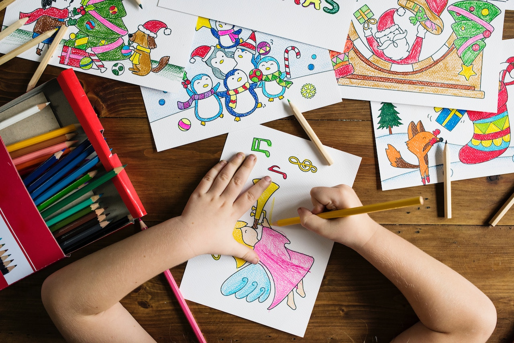

**EARLY EDUCATION**, *Learning Techniques* – Wake up. Take a shower. Brush my teeth. Comb my hair. Get dressed. Leave for work. 

This has been my routine for over a decade. Whenever my routine is interrupted it seems as if the rest of my day is off. 

This is exactly what happens when a child is out of routine or lacks having one at all. Children have more meltdowns and uneasy moments when their routine is off. 

Failing to plan means you must be planning to fail.

**Why Is a Routine So Important?** 

A routine is the most important piece to the puzzle when teaching early learners. Routines help children become independent learners, responsible individuals and accelerated scholars. 

Good habits are birthed through routines and bad habits diminish when routines are practiced often.  If you don’t believe it, try starting a daily routine with your child. 

Complete with meals and naps, make time for short educational experiences: Counting, identifying letters, reading books, and singing songs are activities that can accommodate you and your child’s daily routine. 

Don’t forget to include some play time with a friend or sibling. Children learn best from one another.

**Do Routines Help Adults?**

Routines are also important for adults, both parents and teachers. Why?  Since you asked of course I’ll share.  

When I began studying Early Childhood Education, I was motivated to put what I learned to the test. At the time, I was a first-time preschool teacher in a brand new school with children and families I would come to love. 

I remember setting up my classroom and looking at all of the material and thinking, *“It’s more to preschool than I thought.”* However, I figured it would be easy because at the end of the day – it’s just preschool, so I thought.

As I began lesson planning and trying to apply all the development areas to each student in my class, things became a little overwhelming.  

I’m passionate about the education of young children, and I was determined to prevent any of my students from failing – no matter the sacrifice required.

How was I going to ensure that all of my students got the time that they needed to learn the things that they needed to learn?  

God answers prayer.

That same week, while reading nightly materials for school it leap out at me. The chapter just happened to be about routines and how they support a child’s learning. 

An active routine supports all of a child’s developmental needs and helps them to build relationships with those around them.

I took what I’d learned, used it and it worked – I mean it really works! 

It was almost like a sci-fi experiment seeing how much the children could learn and absorb into their memory.

Every single day we did the same thing. 

I sang the same songs and sometimes read the same stories. 

As they mastered each lesson or activity over time I would gradually change up the routine by changing a song, or teaching colors in Spanish. 

Before I knew it, they became more social with one another, assumed personal responsibility and they took pride in their work. 

The classroom belonged to them and they looked forward to our daily routine.  Not only were they in a routine, but so was I.

I began to feel better in general, more confident, excited and fulfilled.

It was awesome to know that I was responsible for how well my students were progressing – I also got better with time-management and organization. 

Afterward, I started practicing routines with my daughters who are 9 and 12.

I got the same results. 

Their study habits got better and our relationship with one another grew even closer because we spend planned time together regularly.  

I can honestly say the routine in my preschool class made me want to focus more on becoming a better person. 

I realize now what the heart of early learning is all about – my passions have been confirmed.

It’s not just learning ABC’s and 123’s – Early childhood education is about cognitive, social, emotional, and physical development. 

These 4 areas of development are the tools we all need to be great, fair and objective individuals throughout life. 

Routines support these areas of development, as well as, allow children to learn at an increased speed. 

The more they learn the greater they’ll be.

Greatness starts with adults raising children with routines.

I look forward to waking up and greeting students at the start of each class, because my priorities today will change the future tomorrow.
